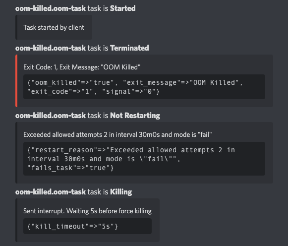
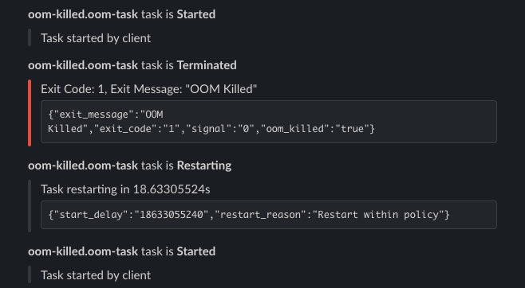

# Nomad Event Streamer

Streams HashiCorp Nomad events to your favorite destinations:

### Discord



### Slack



This project is under active development. Use at your own discretion!

## Usage

Refer to [app.rb](./app.rb) for supported environment variables. 

## Docker

Each commit has a [Docker image](https://github.com/axsuul/nomad-event-streamer/pkgs/container/nomad-event-streamer) built for it or use `ghcr.io/axsuul/nomad-event-streamer:latest`.

## Development

`bundle` then run tests with

```shell
bundle exec rspec
```

## Testing

Below are some job files to test failure and success states.

```terraform
job "oom-killed" {
  datacenters = ["dc1"]
  type = "service"

  group "oom-killed" {
    task "oom-task" {
      driver = "docker"

      env {
        NODE_NAME = "${node.unique.name}"
      }

      config {
        image = "zyfdedh/stress"
        command = "sh"
        args = [
          "-c",
          "sleep 10; stress --vm 1 --vm-bytes 50M",
        ]
      }

      resources {
        memory = 15
      }
    }
  }
}
```

```terraform
job "exit-zero" {
  datacenters = ["dc1"]
  type = "batch"

  group "exit-zero" {
    task "exit-task" {
      driver = "docker"

      config {
        image = "bash"
        command = "bash"
        args = [
          "-c", 
          "sleep 10; exit 0",
        ]
      }
    }
  }
}
```
